# University Activity Management & Verification System
### ระบบบริหารจัดการกิจกรรมนักศึกษาและเช็คชื่อเข้าร่วมด้วย AI สแกนใบหน้าและ Real-Time WebSockets

[](https://laravel.com)
[](https://php.net)
[](https://postgresql.org)
[](https://redis.io)
[](https://laravel.com/docs/reverb)
[](https://python.org)
[](https://tailwindcss.com)

---

## ภาพรวมระบบ (System Overview)

**University Activity System** คือแพลตฟอร์มระดับองค์กรสำหรับการบริหารจัดการกิจกรรมนักศึกษา การลงทะเบียน การสแกนเช็คชื่อเข้างาน และการประมวลผลข้อมูลกิจกรรมแบบ Real-time โดยได้รับการออกแบบด้วยสถาปัตยกรรม High Performance รองรับผู้ใช้งานจำนวนมาก พร้อมระบบยืนยันตัวตนด้วยใบหน้า (AI Face Verification & Liveness Detection) และการเชื่อมต่อการแจ้งเตือนผ่าน LINE Official Account อัตโนมัติ

---

## สถาปัตยกรรมระบบ (System Architecture)

### 1. โครงสร้างและแผนผังระบบรวม (Main System Architecture)


---

### 2. สถาปัตยกรรม Real-Time Communication (Laravel Reverb & WebSockets)


---

### 3. กระบวนการรับส่งข้อมูลการแจ้งเตือน Real-Time (Message Flow)


---

## คุณสมบัติหลักของระบบ (Core Features)

### 1. ระบบยืนยันตัวตนด้วยใบหน้า (AI Face Verification & Liveness Detection)
- **Face Landmark & 3D Mesh Detection:** ตรวจจับโครงหน้าและจุดสำคัญบนใบหน้าแบบ 3D ผ่านเบราว์เซอร์
- **Anti-Spoofing & Liveness Verification:** ระบบป้องกันการปลอมแปลงใบหน้า (รูปถ่าย/วิดีโอ) เพื่อความถูกต้อง 100%
- **InsightFace AI Service:** ประมวลผลและเปรียบเทียบ Face Encodings ความแม่นยำสูงกับฐานข้อมูล

### 2. ระบบสื่อสารและแจ้งเตือน Real-Time (Real-Time Engine)
- **Laravel Reverb WebSockets:** อัปเดตสถานะการเช็คชื่อ จำนวนผู้เข้าร่วม และการแชตสดทันทีโดยไม่ต้อง Refresh หน้าจอ
- **LINE Official Account Integration:** ส่งข้อความแจ้งเตือนผลการลงทะเบียนและการเข้างานไปยัง LINE ของนักศึกษาโดยตรง
- **Redis Queue Worker:** ประมวลผล Background Jobs สำหรับการส่งข้อความและการออกเอกสารแบบ Asynchronous

### 3. ระบบเช็คชื่อเข้าร่วมกิจกรรมอัจฉริยะ (Smart Attendance System)
- **Dynamic QR Code Scanning:** เช็คชื่อเข้างานด้วยการสแกน QR Code แบบปรับเปลี่ยนตามเวลาเพื่อป้องกันการทุจริต
- **Walk-in Registration:** รองรับการลงทะเบียนและเช็คชื่อหน้างานสำหรับผู้ไม่ได้ลงทะเบียนล่วงหน้า
- **Selfie Verification:** ถ่ายภาพยืนยันตัวตนขณะเช็คชื่อเข้างานพร้อมระบบบันทึกพิกัดสถานที่ (Geolocation)

### 4. ระบบการควบคุมสิทธิ์และบันทึกความปลอดภัย (Security & Governance)
- **Role-Based Access Control (RBAC):** กำหนดสิทธิ์ผู้ใช้งานอย่างเป็นสัดส่วน (System Admin, Staff / Organizer, Student)
- **Audit Logging Engine:** บันทึกประวัติการเข้าถึงและการเปลี่ยนแปลงข้อมูลสำคัญในระบบทั้งหมดเพื่อความโปร่งใส
- **Sanctum & OTP Authentication:** ระบบยืนยันตัวตนสองชั้นผ่าน OTP สำหรับการเข้าถึงข้อมูลระดับสูง

### 5. ระบบรายงานและออกเอกสารทางการ (Official Reporting & Transcripts)
- **Activity Transcript Generation:** สร้างเอกสารรับรองการเข้าร่วมกิจกรรม (PDF) พร้อมฟอนต์ภาษาไทยสารบัญ (Sarabun)
- **Excel Data Export/Import:** นำเข้าและส่งออกข้อมูลนักศึกษาและผลการเข้าร่วมกิจกรรมรูปแบบไฟล์ Excel

---

## เทคโนโลยีและส่วนประกอบ (Tech Stack)

| ส่วนประกอบ (Component) | เทคโนโลยีที่ใช้ (Technology) | หน้าที่การทำงาน (Description) |
|:---|:---|:---|
| **Backend Framework** | Laravel 11.x / 12.x | Core Web Application, RESTful APIs, Business Logic |
| **Language** | PHP 8.2+ | Server-side Application Execution |
| **Primary Database** | PostgreSQL 16 | Relational Database for Enterprise Data Storage |
| **Cache & Queue** | Redis | In-Memory Caching & Background Job Queueing |
| **Real-Time WebSockets** | Laravel Reverb | Bi-directional Real-Time Events & Broadcasts |
| **AI Microservice** | Python 3.11 / FastAPI / InsightFace | Face Encoding Extraction & Matching Engine |
| **Frontend Styling** | Tailwind CSS / Alpine.js | Modern Responsive User Interface |
| **Web Server / Proxy** | Nginx & Cloudflare Tunnel | High-Performance Reverse Proxy & Secure HTTPS Tunneling |

---

## เอกสารสถาปัตยกรรมและคู่มือระบบ (Documentation Index)

เอกสารทางเทคนิคและคู่มือการพัฒนาระบบถูกจัดเก็บไว้อย่างเป็นหมวดหมู่ในโฟลเดอร์ [`docs/`](./docs/):

* **[คู่มืออ้างอิง API (API Quick Reference)](./docs/API_QUICK_REFERENCE.md)** — รายละเอียดและโครงสร้าง API Endpoints
* **[คู่มือการทดสอบ API (API Testing Guide)](./docs/API_TESTING_GUIDE.md)** — วิธีการทดสอบระบบ API
* **[ระบบสแกนใบหน้า AI (Face System Summary)](./docs/FACE_SYSTEM_SUMMARY.md)** — สถาปัตยกรรมและการทำงานของระบบสแกนใบหน้า
* **[คู่มือสถาปัตยกรรม InsightFace (InsightFace Architecture)](./docs/INSIGHTFACE_ARCHITECTURE.md)** — โครงสร้างแบบจำลอง AI
* **[ระบบ Real-Time Chat & Reverb (Laravel Reverb Setup)](./docs/laravel-reverb-chat-agent.md)** — สถาปัตยกรรม WebSockets
* **[คู่มือตั้งค่าระบบเครือข่าย (Network Setup Guide)](./docs/NETWORK_SETUP_GUIDE.md)** — การเชื่อมต่อ Network และ Cloudflare Tunnel

---

## ขั้นตอนการติดตั้งและเริ่มใช้งาน (Deployment & Installation)

### 1. คัดลอก Repository และติดตั้ง Dependencies
```bash
git clone https://github.com/GitNonta/uni-activity.git
cd uni-activity

# ติดตั้ง PHP Dependencies
composer install

# ติดตั้ง Frontend Dependencies
npm install
```

### 2. ตั้งค่า Environment File
```bash
cp .env.example .env
php artisan key:generate
```

### 3. ตั้งค่าและเตรียมฐานข้อมูล (Database Migration & Seeding)
```bash
php artisan migrate --seed
```

### 4. เรียกทำงานบริการหลัก (Start Core Services)
```bash
# รัน Queue Worker
php artisan queue:work redis

# รัน Laravel Reverb (WebSocket Server)
php artisan reverb:start --host=0.0.0.0 --port=8082

# รัน Frontend Build / Dev Server
npm run dev
```

---

<p align="center">
  Developed for University Activity Management & Verification System<br>
  <strong>Official Enterprise Documentation</strong>
</p>
