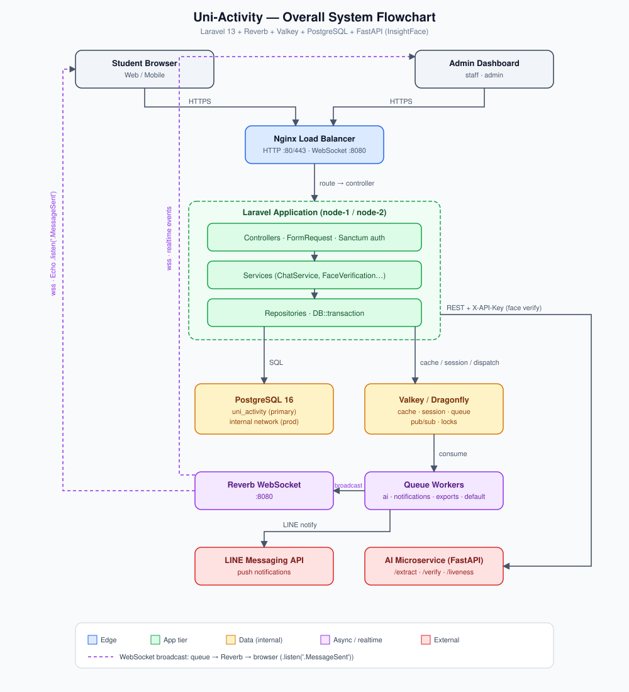
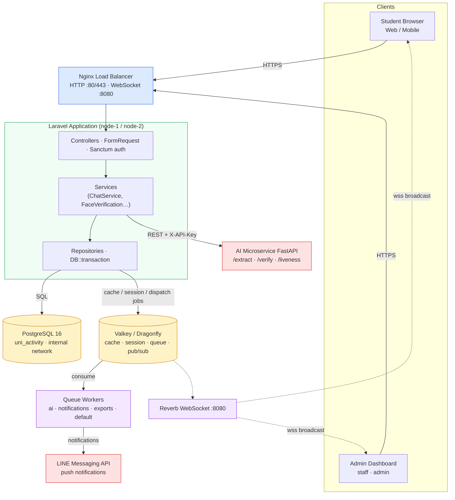
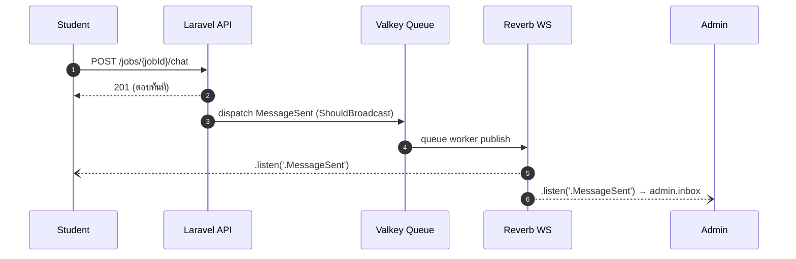

# PROJECT FLOWCHART — Uni-Activity

ภาพรวม Flowchart ของระบบทั้งหมดในไฟล์เดียว มี 2 รูปแบบ: **SVG** (ไฟล์แยก) และ **Mermaid.js** (render อัตโนมัติบน GitHub/GitLab)

- ไฟล์ SVG: [`docs/flowchart.svg`](./flowchart.svg)
- เวอร์ชันเชิงลึกแยกรายฟีเจอร์: [`docs/FLOWCHARTS.md`](./FLOWCHARTS.md)

---

## 1) SVG version

---

## 2) Mermaid.js version

### Realtime chat path (ย่อ)

