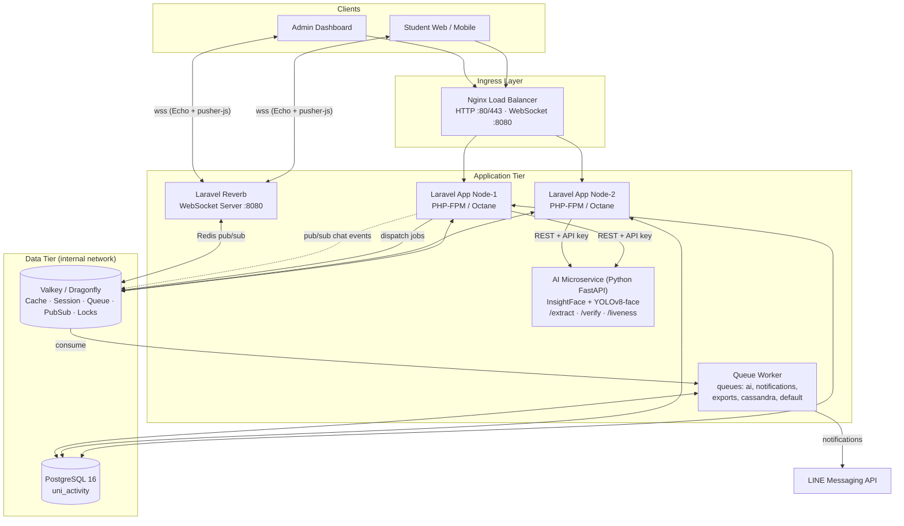
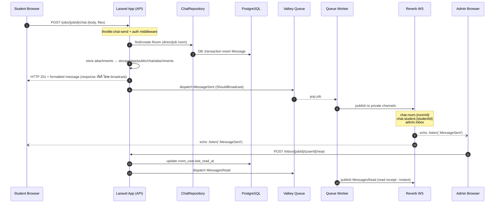
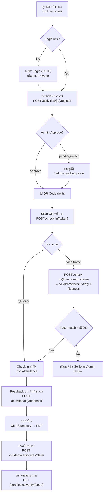
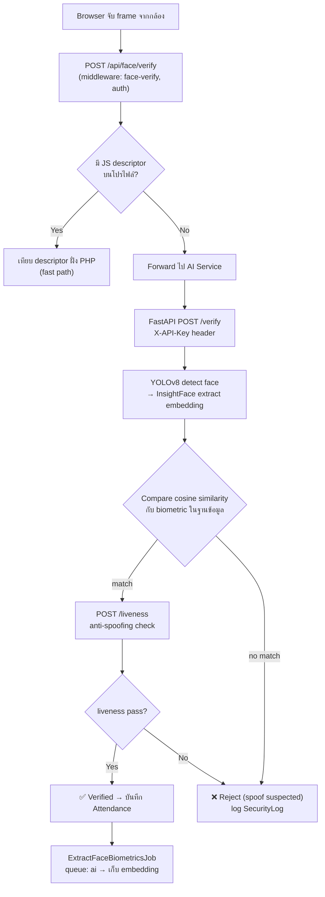
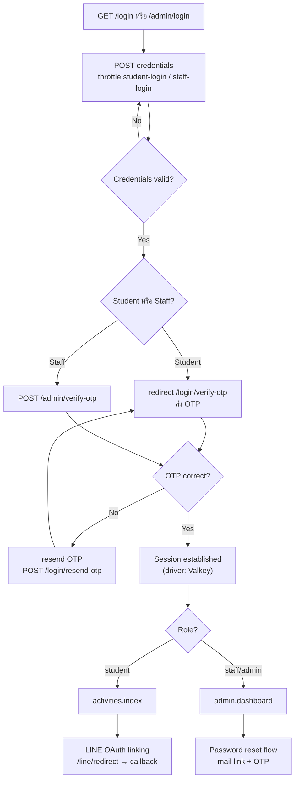
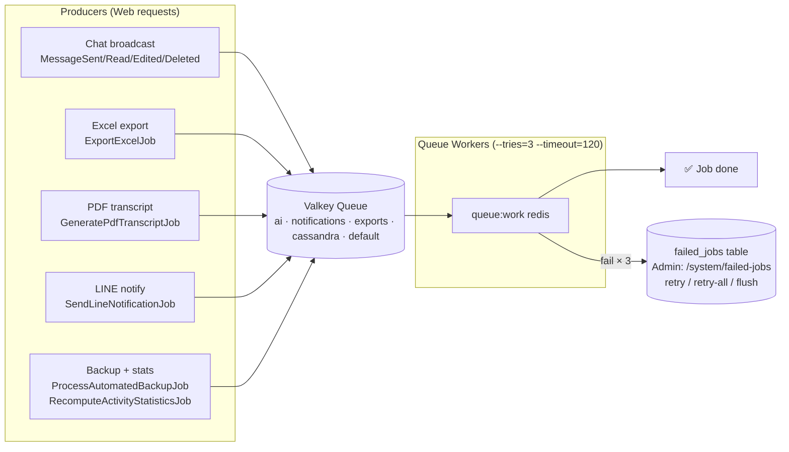
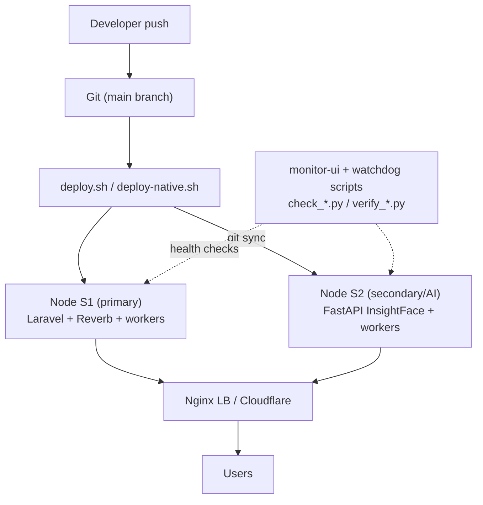

# FLOWCHARTS — Uni-Activity System

แผนภาพ Flowchart หลักของโปรเจกต์ (วาดด้วย [Mermaid](https://mermaid.js.org/) — แสดงผลได้บน GitHub/GitLab)
สถาปัตยกรรมอ้างอิงจาก: `docker-compose.yml`, `docker-compose.prod.yml`, `routes/web.php`, `routes/channels.php`, `app/Services/ChatService.php`, `app/Events/MessageSent.php`, `ai_service/server.py`

---

## 1. System Architecture Overview (Deployment Topology)

ใช้เป็นภาพรวมก่อนสุด — แสดงองค์ประกอบ Infrastructure ทั้งหมด

> Production (`docker-compose.prod.yml`) เพิ่ม Zero Trust: PostgreSQL และ Valkey อยู่บน `backend-network` ที่ตั้งค่า `internal: true` เข้าถึงจาก Internet ไม่ได้ มีเฉพาะ Nginx Ingress ที่ expose 80/443/8080

---

## 2. Real-time Chat Flow (Student ↔ Admin)

Flow หลักของระบบ: `ChatController → ChatService → ChatRepository → MessageSent event → Reverb`

**Channels ที่ต้อง authorize ใน `routes/channels.php`:**

| Channel | ผู้ใช้ | เงื่อนไข |
|---|---|---|
| `chat.room.{roomId}` | ทั้งคู่ | เป็นสมาชิกห้อง |
| `chat.student.{userId}` | Student | id ตรงกับตัวเอง |
| `admin.inbox` | Staff/Admin | `isStaffOrAdmin()` |
| `online` (presence) | ทุก role | login แล้ว |

---

## 3. Student Activity Lifecycle (ลงทะเบียน → เช็คอิน → ชั่วโมงกิจกรรม)

---

## 4. Face Verification Flow (Check-in ด้วยใบหน้า)

---

## 5. Authentication Flow (Student / Staff + OTP)

---

## 6. Queue Jobs Processing Flow

---

## 7. Deployment / Dev Loop (CI → Cluster Nodes)

---

### Checklist เวลาวาด Flowchart เอง

- Event ทุก broadcast path ต้องผ่าน queue (`ShouldBroadcast`) — อย่าลืมวาด worker แยกจาก web request
- Data tier ฝั่ง production วาดใน `internal network` เสมอ
- Chat events ฟังด้วย `.listen('.MessageSent')` (มี dot นำหน้า เพราะใช้ `broadcastAs()`)
