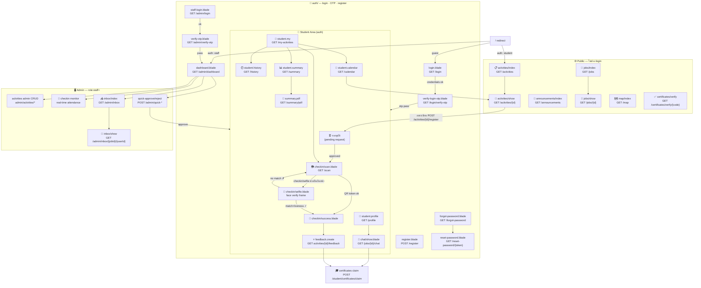
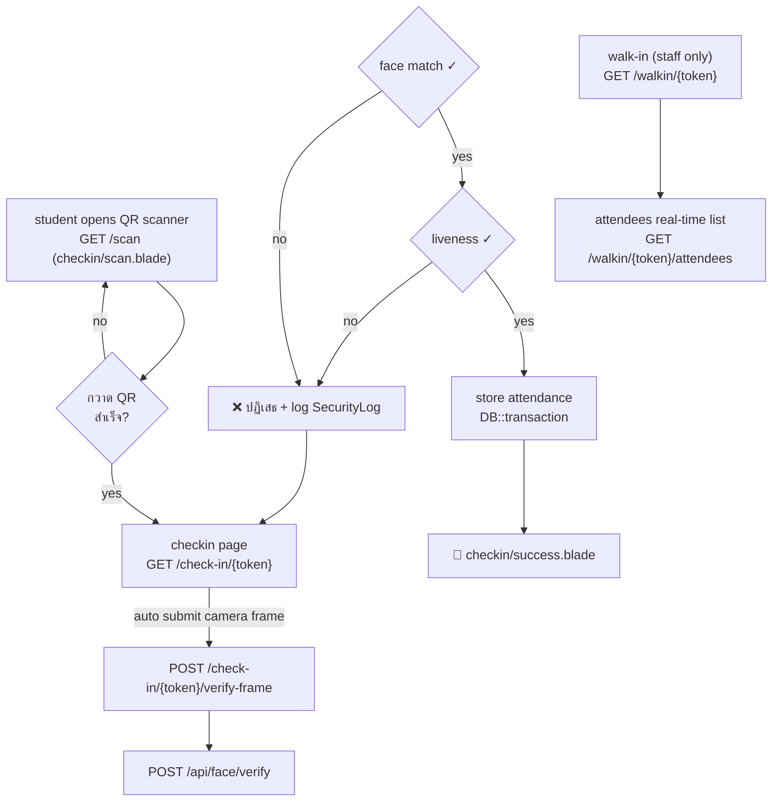
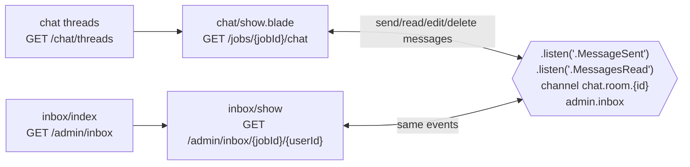

# SCREEN FLOWCHART — Uni-Activity (actual working screens)

Flowchart ของ **หน้าจอการใช้งานจริงของเว็บไซต์** ทั้งหมด อ้างอิงจากไฟล์ Blade view (`resources/views/**`) และ `routes/web.php`
รูปแบบ: Mermaid.js (render อัตโนมัติบน GitHub/GitLab) — SVG version: [`flowchart.svg`](./flowchart.svg)

---

## 1) Student Journey — เข้าเว็บครั้งแรก → ใบรับรอง

---

## 2) Check-in Screens Detail

---

## 3) Realtime Chat Screens

---

### Screen inventory (from `resources/views`)

| Area | Screens |
|---|---|
| Public | activities index/show, announcements, jobs index/show, map, certificate verify |
| Auth | login, register, verify-login-otp, staff-login, verify-otp, forgot/reset-password |
| Student | my-activities, history, summary (+PDF), calendar, profile, scanner, selfie, success |
| Chat | chat/show, threads |
| Admin | dashboard, activities/*, inbox, students, users, categories, exports, audit-logs, security, backups, settings, api-keys, cluster, failed-jobs |
